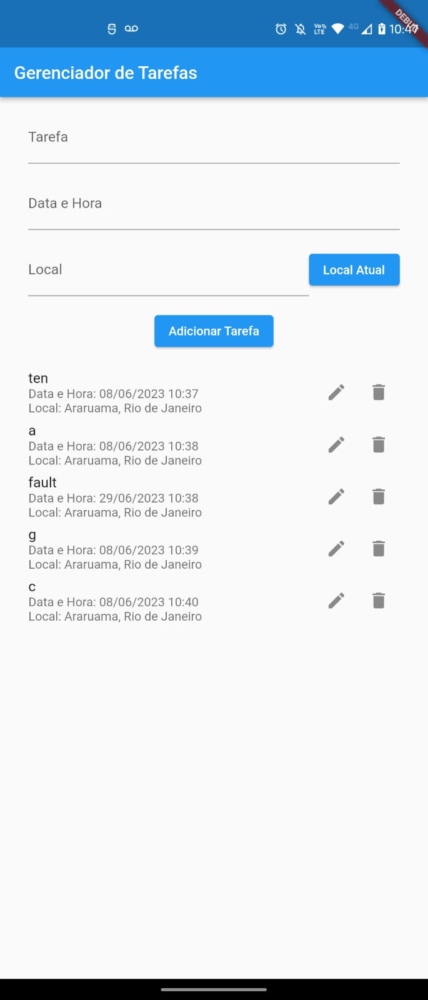

# InFlutter

Projeto final da disciplina Desenvolvimento Mobile com Flutter [23E2_2] do Instituto Infnet. 

## Apresentação do projeto

O projeto consiste em um gerenciador de tarefas simples que disponibiliza um seletor de data, hora e um botão para buscar a localização atual do usuário. Ao clicar em adicionar tarefa, os dados são apresentados em uma lista onde podem ser editados ou removidos.

## Prints do Aplicativo

